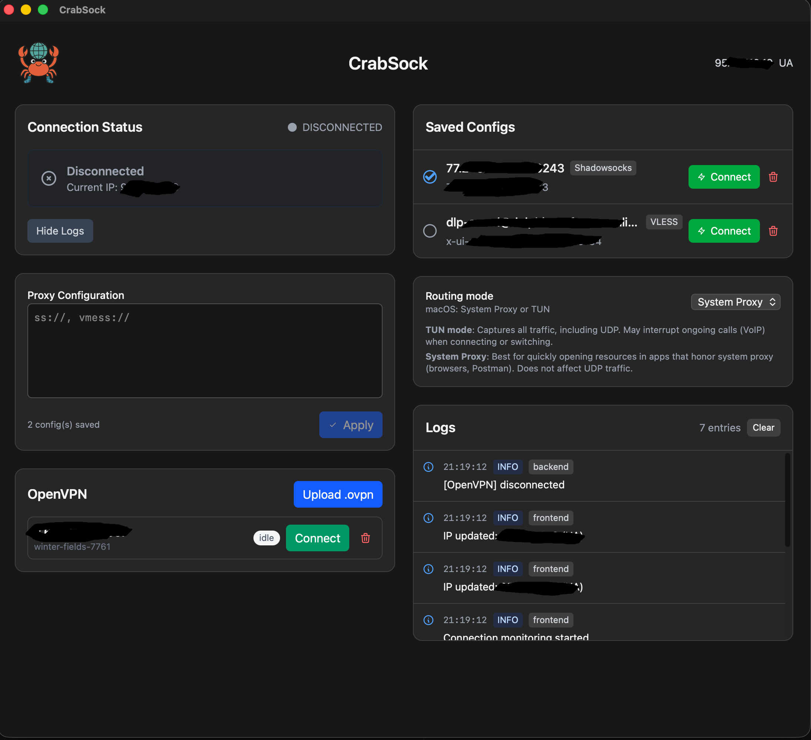

# CrabSock

Open‑source, cross‑platform proxy/VPN app built with Rust + Tauri.



CrabSock makes fast and secure internet access simple: one click routes traffic via an intelligent System Proxy or TUN with correct bypasses for local networks and VPN routes.

## Platforms

- macOS: Intel (x86_64) and Apple Silicon (arm64)
- Windows: x86_64, arm64 (where supported)
- Linux: x86_64/arm64, X11/Wayland

Binary packages: `app`/`dmg` (macOS), `msi` (Windows), `deb`/`rpm` (Linux). Build from source with a single command.

## What it does

- Quickly enables a System Proxy at the OS level so browsers/tools immediately use the local proxy
- Can capture all traffic (TUN) for maximum compatibility
- Correctly bypasses local/corporate networks and VPN routes so internal resources remain direct
- Provides a simple UI with saved configs, logs, and external IP monitoring

## Problems we solve

- Apps that don’t honor the system proxy.  
  Some clients (messengers, IDEs, CLIs) ignore OS proxy settings. TUN mode captures all traffic (including UDP) so these apps work too.

- Need a quick switch for browsers and tools.  
  System Proxy enables local HTTP CONNECT and SOCKS5 so Chrome/Safari/Edge, Postman, etc. work through the proxy without manual setup.

- Need split‑tunneling: local/corporate networks must remain direct.  
  We use PAC and ACL logic: private subnets (10/8, 172.16/12, 192.168/16, 169.254/16, 100.64/10, etc.) and routes to VPN interfaces (utun/Wintun/TAP/WireGuard/OpenVPN) go DIRECT; other traffic goes via proxy.

- One client — two VPN types, without conflicts.  
  Two stacks in one app: Shadowsocks/sing‑box and OpenVPN. Store multiple profiles and connect as needed. The app prevents conflicting modes from running together and cleans up system settings when switching (see `src-tauri/PROXY_CONFLICTS.md`).

- Minimal manual setup across OSes.  
  macOS: `networksetup` + PAC; Windows: registry (HKCU) + PAC + WinInet refresh; Linux: GNOME/KDE managers or env variables as a fallback.

## Features

- System Proxy mode (Windows/macOS/Linux): smart HTTP CONNECT proxy (127.0.0.1:8080) + SOCKS5 (127.0.0.1:1080) with ACL bypass of private/VPN networks
- TUN mode: capture all system traffic (including UDP) for maximum compatibility
- Shadowsocks, VLESS/Vmess (via sing‑box) — local clients and routing
- OpenVPN integration (import/connect .ovpn profiles)
- PAC for dynamic internal network bypass (macOS/Windows)
- Saved configurations and quick switching
- External IP monitoring and logging
- Cross‑platform: macOS, Windows, Linux

## Quick start by OS

### macOS
- Download `CrabSock.app` or `dmg` from releases and install.
- System Proxy and PAC are configured via `networksetup`; TUN is available where supported.
- On first launch, the OS may request permissions (network settings).

### Windows
- Install the `msi` from releases.
- System Proxy is configured via registry (HKCU\Internet Settings); PAC is applied to bypass VPN routes.
- Runs under the current user (user‑scope proxy settings).

### Linux
- Use `deb`/`rpm` or build from source.
- GNOME (`gsettings`) and KDE (`kwriteconfig5`) are supported directly; other desktops fall back to environment variables.
- TUN requires `cap_net_admin` (set automatically on first release launch).
- No manual `setcap` is needed — the app requests privileges and sets the capability automatically.

## Installation from source

Prefer releases (deb/rpm/app/dmg/msi) when available, or build from source.

### Development

```bash
npm run tauri:dev
```

### Release

1. Build:
```bash
npm run tauri:build
```

2. Run (Linux, Wayland/X11 compatibility):
```bash
WEBKIT_DISABLE_DMABUF_RENDERER=1 ./src-tauri/target/release/crab-sock
```

Note: on first start, the release binary will request privileges via pkexec/sudo
to set `cap_net_admin` and will fast‑restart. Manual scripts like `set_capability.sh` are not required.

### macOS (build)

- System Proxy and PAC are configured via `networksetup`; TUN is available where supported.
- `app/dmg` is produced by `npm run tauri:build`.

### Windows (build)

- System Proxy is configured via registry (HKCU\Internet Settings), with PAC to bypass VPN routes.
- `msi` is produced by `npm run tauri:build`.

## How it works / Architecture

- Local SOCKS5 (127.0.0.1:1080) is provided by shadowsocks‑rust/sing‑box.
- sing‑box protocols: VLESS/Vmess (and others) are used for local proxies/routes.
- Local ACL‑aware HTTP CONNECT (127.0.0.1:8080) forwards via SOCKS5, but DIRECT‑bypasses:
  - private networks (10.0.0.0/8, 172.16/12, 192.168/16, 169.254/16, etc.)
  - routes that go through VPN interfaces (macOS: utun/pritunl; Windows: TAP/Wintun/WireGuard; Linux: environment‑dependent)
- System Proxy:
  - macOS: `networksetup` enables HTTP/HTTPS proxy and PAC
  - Windows: registry (HKCU) + PAC, WinInet refresh
  - Linux: GNOME/KDE proxy managers, otherwise env vars
- TUN mode:
  - Captures all traffic (including UDP) for apps that ignore the system proxy
  - Requires `cap_net_admin` (Linux); the app requests and sets the capability automatically

## TUN Mode

TUN Mode creates a virtual network interface for improved proxying. In the current implementation:

- A TUN interface is created to monitor network traffic
- System Proxy is used to route traffic
- Provides better compatibility with various applications
- Does not block the internet connection

### Requirements for TUN Mode

- Linux system
- Administrator privileges (sudo)
- `cap_net_admin` capability

### Using TUN Mode

1. Connect to a VPN profile
2. Enable "TUN Mode" in settings
3. On first enable the app will request privileges (pkexec/sudo), set the capability and restart automatically

## Configurations

Configurations are stored at `~/.config/CrabSock/configs.json`

## System Proxy
 
Enabling "System Proxy" turns on the local proxies:

- HTTP CONNECT: 127.0.0.1:8080 (ACL‑aware; DIRECT for private/local networks)
- SOCKS5: 127.0.0.1:1080
 
macOS: configured via `networksetup` + PAC.  
Windows: registry + PAC.  
Linux: GNOME (`gsettings`) / KDE (`kwriteconfig5`), otherwise environment variables.

## Troubleshooting

### TUN Mode doesn’t work

1. Ensure you are running the release build, not development
2. Verify capability: `getcap ./src-tauri/target/release/crab-sock`
3. Ensure you have sudo privileges

### White screen after restart

This is a known issue in development mode. Use the release build for stability.

### "Operation not permitted"

Make sure that:
1. You run the release build
2. The capability `cap_net_admin=ep` is set
3. The TUN interface is not occupied by another process

## Why CrabSock?

- Open‑source, no telemetry, easy to audit
- Rust backend: performance and reliability
- Friendly UI on Tauri + Vite
- Works with common tools (browsers, Postman, etc.)

## Tech stack

- Rust (Tokio, Tauri backend)
- Tauri + Vite + Vue frontend
- shadowsocks‑rust / sing-box (VLESS/Vmess and others)
- OpenVPN (CLI/embedded)

## Keywords

open source vpn client, system proxy, tun mode, socks5, http connect proxy, macos, windows, linux, tauri, rust, shadowsocks, vless, vmess, openvpn, pac, acl proxy, cross platform, apple silicon, arm64, x86_64